# BÀI 1
## Get danh sách rỗng 200 + POST OK 201
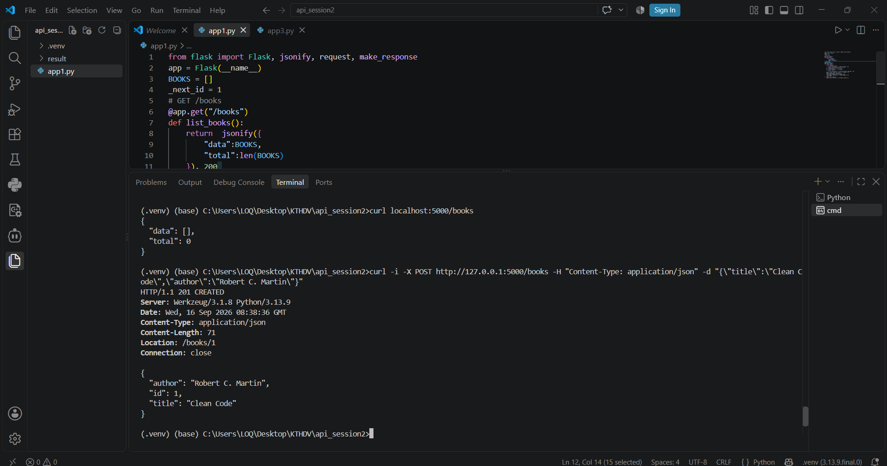
## Gửi request không có Content-Type 415
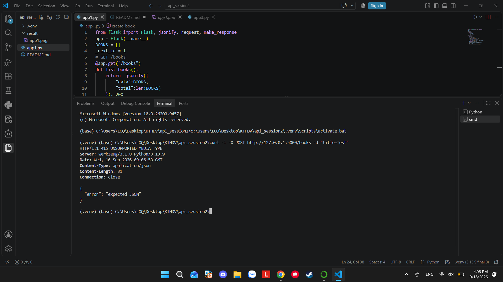
## Thiếu author 422
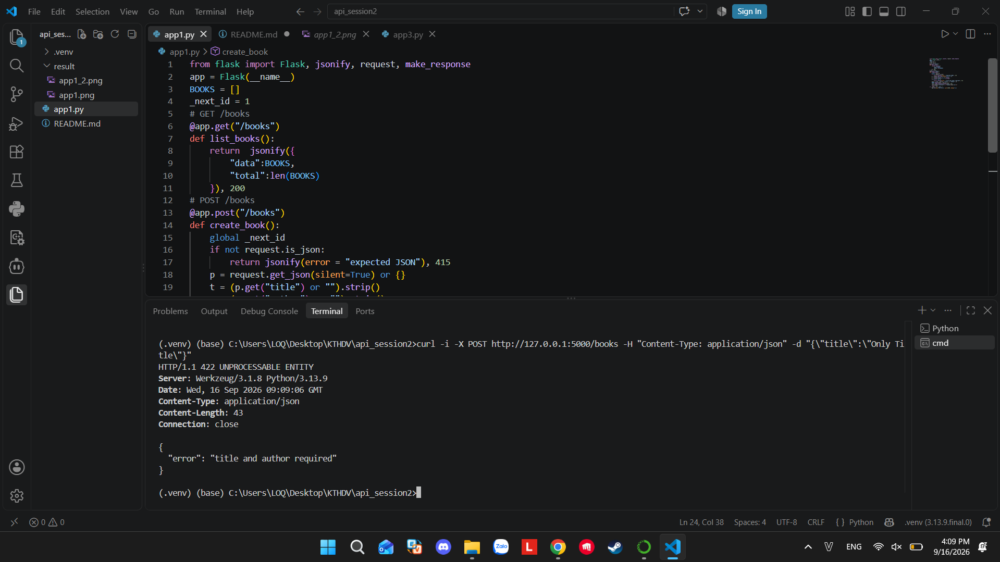
# BÀI 2
## PATCH - cập nhật giá price của sách ID 1 thành 19.99
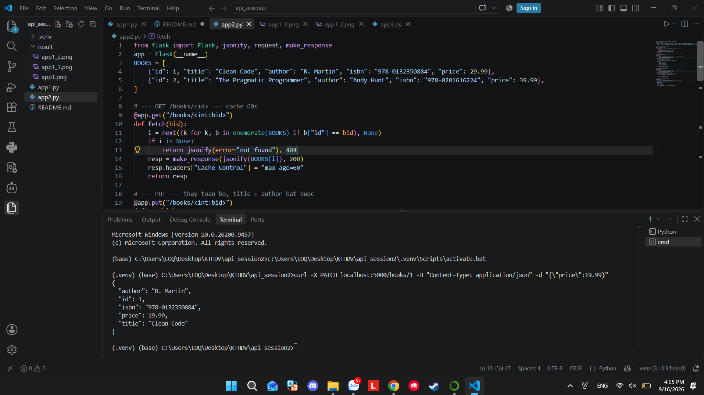
## PUT - thay sách ID 1 bằng title và author khác
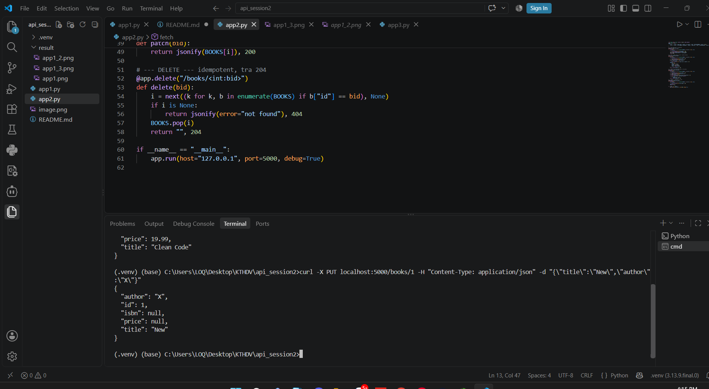
## DELETE - Xoá cuốn sách ID 1
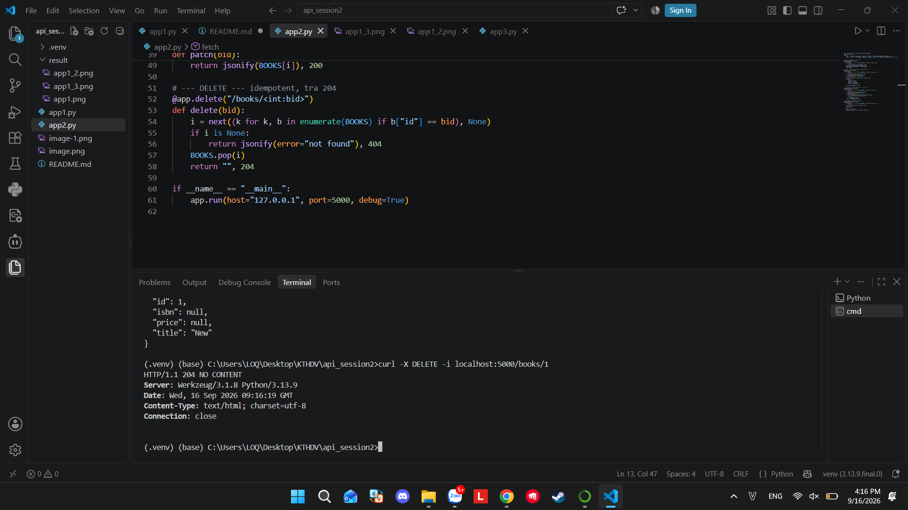
# BÀI 3
## Phân trang (page = 2, size = 10)
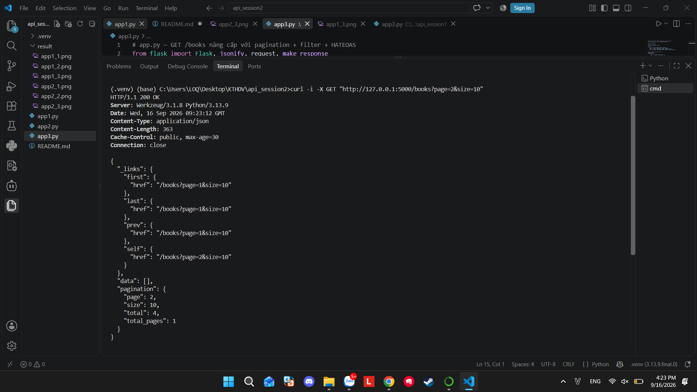
## Lọc theo tác giá (author = Orwell) 
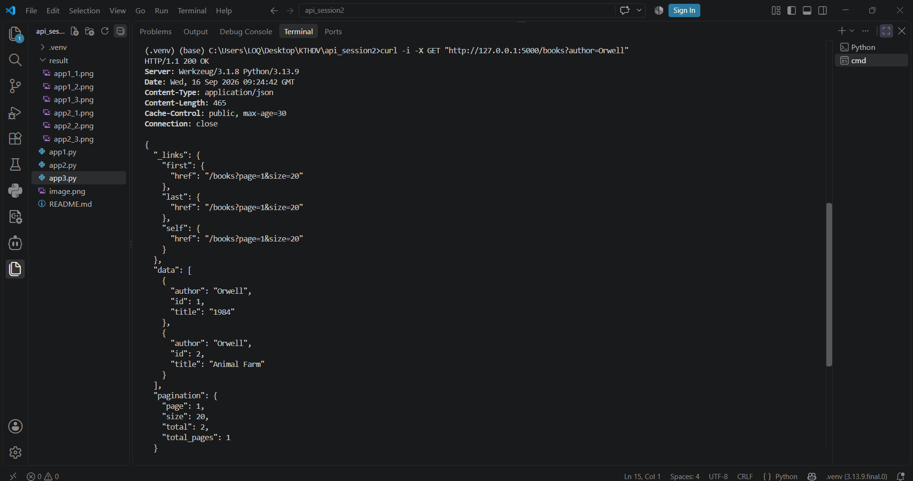
## Lọc theo từ khoá trong tiêu đề(q = clean)
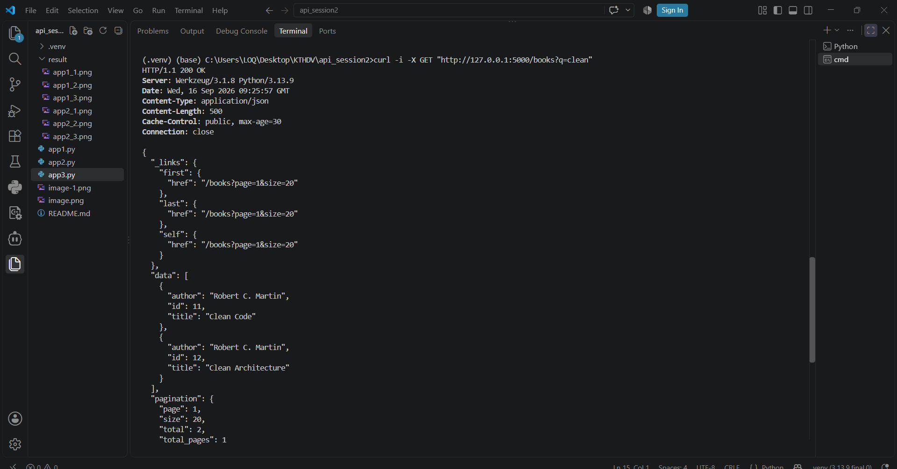
## Lọc theo header Accept
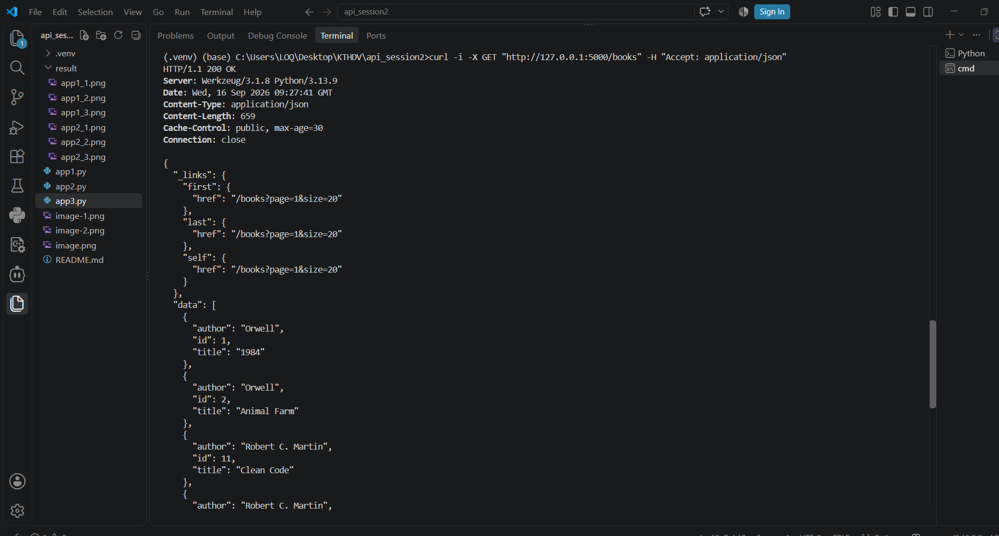
## Vượt MAX_SIZE (tự động cap về 100)
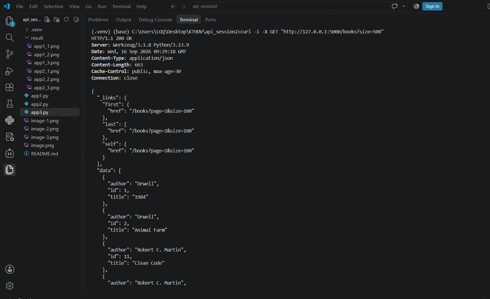